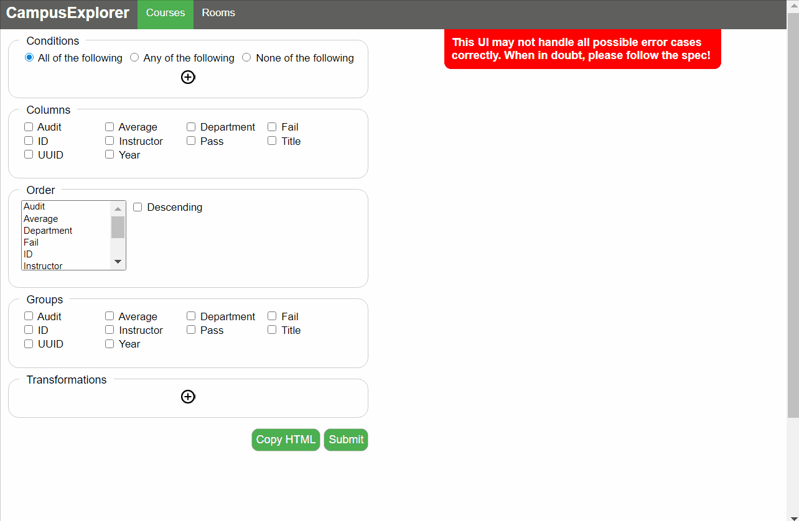
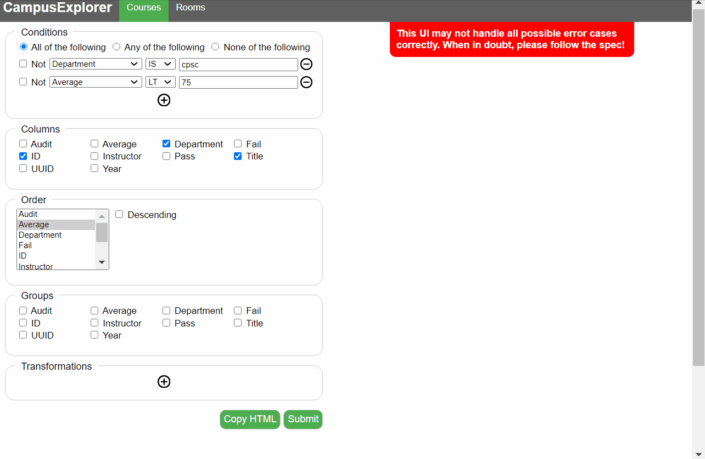
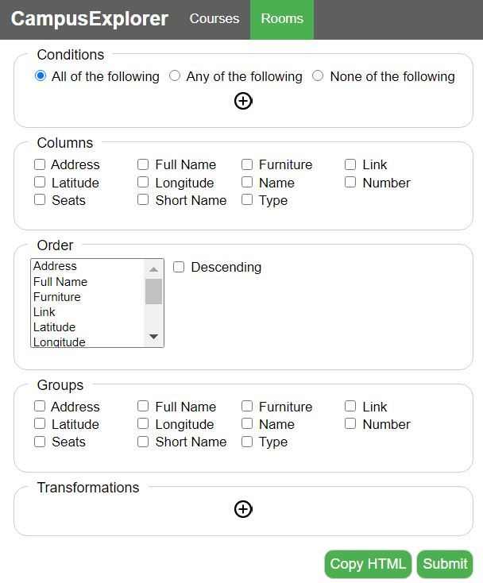

# University Explorer

Full stack web application built to explore Courses and Rooms at UBC, as a part of a term-long project. 

Allows users to find data such as course averages, instructors, departments, pass/fail numbers as well as room locations, seats, types and furniture. Front-end form allows users to input various complex queries, which are then validated, transformed into JSON and used to filter dataset. 

## Demo

Here is a basic example of a query on the courses database. A computer science students wants to know which CPSC courses have an average less than 75%, as well as the corresponding instructor and year (presumably to know which courses to avoid  ).

Two conditions are specified, 6 columns to display, and the results are ordered by the average in ascending order.

Here is the same query, but with more added complexity. In the previous query, the student received data on every course section that met the selection criteria (for example: one course can be offered up to 4+ times in the same year). 

In this case, the student wants to know data on the course itself (i.e. all course sections ever offered that meet the selection criteria). Courses are grouped by department, id and title; while two transformations calculate overall average, and average number of students failed per section. 

Additionally, rooms at UBC can be queried in the same manner. For completeness, the photo below displays parameters to be queried.

